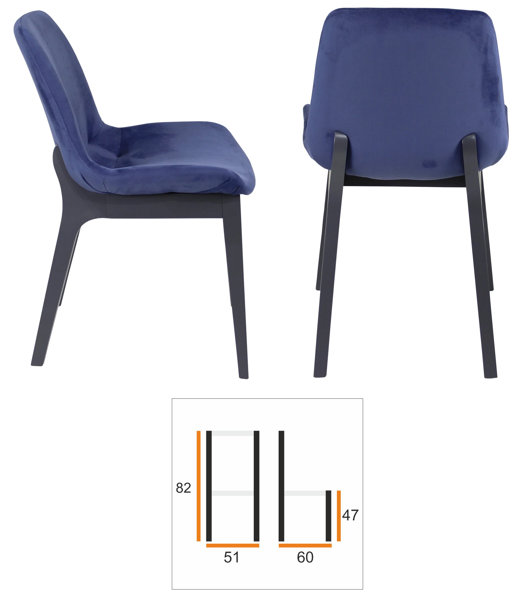

есть склад, на нём детали для кресел и стульев; есть спецификация для этих кресел и стульев (например стул А состоит из: сидушка красная - 1 шт, ножки - 4 шт, болты - 10шт, и так далее) Нужно написать программу, которая по остаткам склада вычислит:
- каких изделий можно произвести больше?
- каких изделий нужно произвести, что бы получить максимальную выгоду (в спецификации есть отпускная цена, в остатках склада - закупочная цена деталей)?

-------------------------------------
Стул Ева. Полностью деревянная модель 

Материалы:
- Ножки задние(Hind_legs) 83х15х15 2шт доска
- Ножки передние(Front_legs) 47х15х15 2шт доска
- Диагонали сидушки(Seat_diagonals) 68х25х15 2шт доска
- Сидушка(Seat) 44х52х4 1шт фанера
- Вверхняя спинка(Upper_back) 44х22х4 1шт фанера
- Саморезы(Screws) 12шт
- Столярный клей(Glue) 200г

----------------------------------------
Стул Эми. Мягкие сиденье и спинка на деревянном каркасе

Материалы:
- Ножки задние(Hind_legs) 87х15х15 2шт доска
- Ножки передние(Front_legs) 49х15х15 2шт доска
- Диагонали сидушки(Seat_diagonals) 77х25х15 2шт доска
- Сидушка(Seat_textile) 53х56х8 1шт ткань
- Вверхняя спинка(Upper_back_textile) 58х35х8 1шт ткань
- Саморезы(Screws) 12шт
- Столярный клей(Glue) 200г

----------------------------------------------
Стул Фиби. Деревянный каркас и объединенная сиденье и спинка

Материалы:
- Ножки задние(Hind_legs) 50х15х15 2шт доска
- Ножки передние(Front_legs) 47х15х15 2шт доска
- Горизонтали ножек(Horizontals_legs) 40х25х15 2шт доска
- Сидушка(Seat_textile) 60х41 1шт ткань
- Саморезы(Screws) 12шт
- Столярный клей(Glue) 200г

-------------------------------------------------
